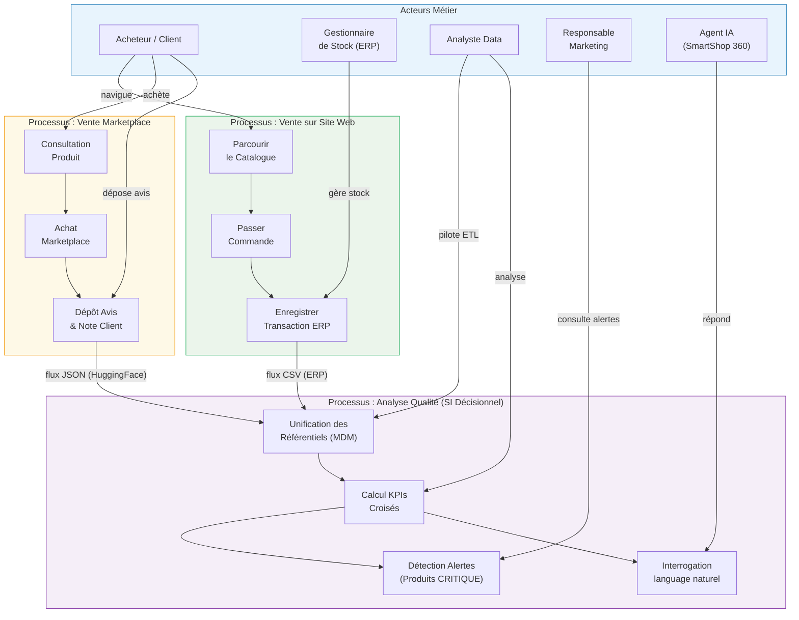
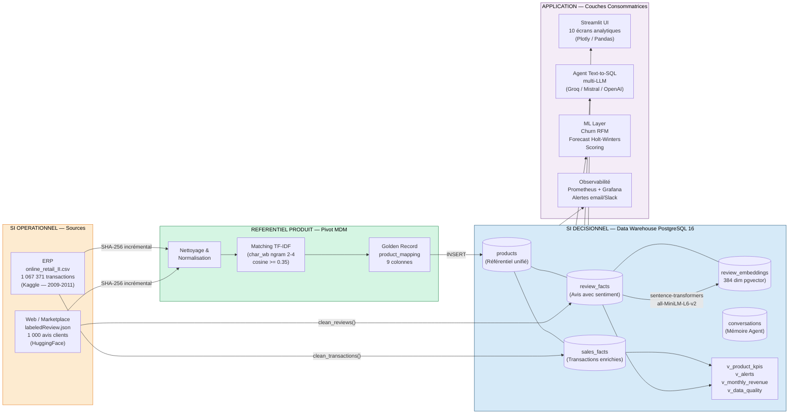
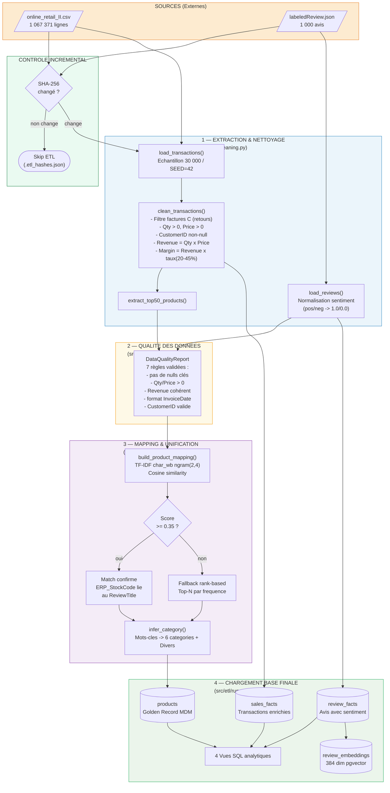
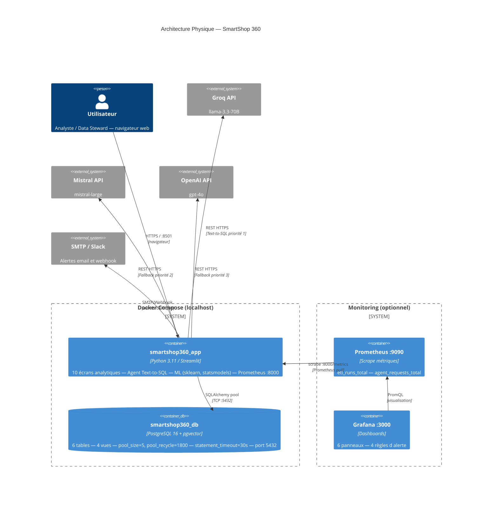
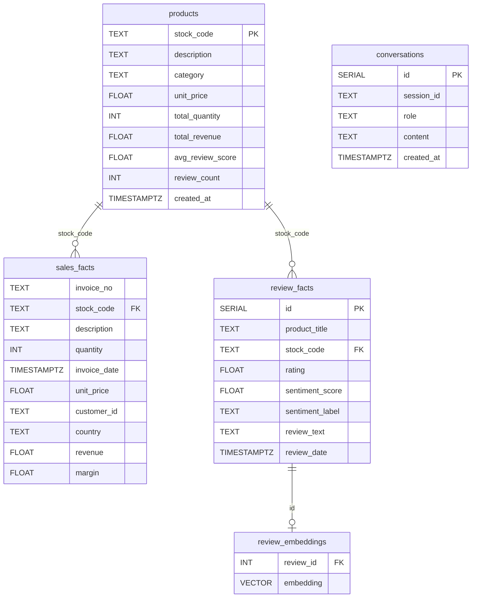

# SmartShop 360 — Livrables Urbanistiques & Architecture

> **Document de référence** — Modélisation du SI, diagrammes techniques, stratégie MDM
> et dictionnaire de données.

---

## Table des matières

1. [Vue Métier (ArchiMate)](#1-vue-métier)
2. [Vue Transformation — SI Opérationnel → MDM → SI Décisionnel](#2-vue-transformation)
3. [Diagramme de Flux de Données (DFD) — Pipeline ETL](#3-diagramme-de-flux-de-données-dfd)
4. [Schéma d'Architecture Physique (C4 Level 2)](#4-schéma-darchitecture-physique)
5. [Stratégie MDM — Choix et Justification](#5-stratégie-mdm)
6. [Dictionnaire de Données](#6-dictionnaire-de-données)

---

## 1. Vue Métier

> **Style ArchiMate** — Processus existants, acteurs et flux métier inter-silos.



### Lecture

| Acteur | Rôle dans la chaîne de valeur |
|--------|-------------------------------|
| **Acheteur / Client** | Génère les transactions ERP et les avis marketplace |
| **Gestionnaire de Stock** | Saisit et valide les données dans l'ERP |
| **Analyste Data** | Pilote le pipeline ETL, supervise la qualité MDM |
| **Responsable Marketing** | Consomme les alertes produits CRITIQUE (Note < 3.0 ET Qté > 50) |
| **Agent IA** | Répond aux questions en langage naturel via Text-to-SQL |

---

## 2. Vue Transformation

> **SI Opérationnel → Référentiel Produit MDM → SI Décisionnel**
> Le composant MDM est le **pivot** qui brise les deux silos sans identifiant commun.



### Séparation SI Opérationnel / SI Décisionnel

| Dimension | SI Opérationnel | SI Décisionnel |
|-----------|----------------|----------------|
| **Rôle** | Capturer les faits bruts | Analyser, croiser, alerter |
| **Sources** | CSV Kaggle + JSON HuggingFace | PostgreSQL 16 (Data Warehouse) |
| **Granularité** | Ligne de commande / Avis individuel | Agrégats mensuels, scores produits |
| **Latence** | Temps réel / batch | Batch ETL (incrémental SHA-256) |
| **Pivot MDM** | Aucun identifiant commun | `product_mapping` — Golden Record |

---

## 3. Diagramme de Flux de Données (DFD)

> **Pipeline ETL complet** : Source → Nettoyage → Qualité → Mapping/Unification → Base Finale.



### Détail des étapes

| Étape | Fichier | Entrée | Sortie | Règles métier clés |
|-------|---------|--------|--------|--------------------|
| **Extraction** | `cleaning.py` | CSV brut (1 M lignes) | DataFrame 30 000 lignes (SEED=42) | Échantillon reproductible |
| **Nettoyage transactions** | `cleaning.py` | DataFrame brut | DataFrame propre | Filtre factures `C`, Qty/Price > 0, suppression CustomerID null |
| **Nettoyage avis** | `cleaning.py` | JSON HuggingFace | DataFrame sentiment normalisé | `positive` → 1.0, `negative` → 0.0 |
| **Qualité données** | `data_quality.py` | DataFrames nettoyés | `DataQualityReport` (7 règles) | Validation pré-chargement |
| **MDM Matching** | `mdm_mapping.py` | Top-50 produits ERP + titres avis | `product_mapping` (9 colonnes) | TF-IDF cosine ≥ 0.35 / fallback rank |
| **Chargement** | `run_etl.py` | DataFrames validés | 6 tables + 4 vues PostgreSQL | DDL idempotent (`CREATE TABLE IF NOT EXISTS`) |

---

## 4. Schéma d'Architecture Physique

> **Style C4 Level 2 (Conteneurs)** — Infrastructure Docker, flux réseau, API externes.



### Ressources et ports

| Conteneur | Image | Port exposé | Volume |
|-----------|-------|-------------|--------|
| `smartshop360_db` | `postgres:16-alpine` | `5432` | `pgdata` (persistant) |
| `smartshop360_app` | `Dockerfile` (Python 3.11-slim) | `8501` | `./Data:/app/Data` (ro) |
| `prometheus` | `prom/prometheus` | `9090` | — |
| `grafana` | `grafana/grafana` | `3000` | — |

### Résilience de l'Agent Text-to-SQL

La chaîne de fallback garantit que l'application reste opérationnelle sans clé API :

```
Groq (llama-3.3-70B) → Mistral (mistral-large) → OpenAI (gpt-4o) → Anthropic → Fallback SQL (règles)
```

---

## 5. Stratégie MDM

### 5.1 Problématique

Les deux sources de données (**ERP** et **Marketplace**) ne partagent aucun identifiant commun :

- L'ERP identifie les produits par un `StockCode` alphanumérique (ex. `85123A`)
- Les avis clients référencent les produits par leur **nom textuel** (ex. `"WHITE HANGING HEART T-LIGHT HOLDER"`)

**Conséquence** : impossible de croiser directement « CA par produit » et « note moyenne par produit » sans une couche de réconciliation.

### 5.2 Implémentation POC (ce projet)

#### Niveau 1 — TF-IDF sur n-grammes de caractères

```python
# src/etl/mdm_mapping.py
vectorizer = TfidfVectorizer(
    analyzer="char_wb",   # n-grammes de caractères (robuste aux abréviations)
    ngram_range=(2, 4),   # bigrammes à 4-grammes
    min_df=1,
)
matrix = vectorizer.fit_transform(all_names)
similarity = cosine_similarity(erp_vectors, review_vectors)
```

**Seuil de décision** : `cosine_similarity ≥ 0.35`
- Au-dessus : **match confirmé** → `ERP_StockCode` lié au `ReviewProductTitle`
- En-dessous : **fallback rank-based** → on associe le N-ième produit le plus fréquent

#### Niveau 2 — Inférence de catégorie

```python
_CATEGORY_RULES = [
    (["bag", "tote", "purse"],          "Sacs & Accessoires"),
    (["candle", "light", "lamp"],       "Bougies & Luminaires"),
    (["mug", "cup", "tea", "coffee"],   "Cuisine & Table"),
    (["frame", "sign", "card"],         "Papeterie & Décoration"),
    (["christmas", "xmas", "santa"],    "Fêtes & Saisonniers"),
    (["garden", "plant", "pot"],        "Jardin & Extérieur"),
]
# Fallback : "Divers"
```

#### Résultat : table `product_mapping` (Golden Record)

| Colonne | Description |
|---------|-------------|
| `ERP_StockCode` | Identifiant ERP (clé primaire de réconciliation) |
| `ERP_ProductName` | Libellé normalisé côté ERP |
| `ReviewProductTitle` | Libellé côté avis client |
| `MatchScore` | Score cosinus TF-IDF (0.0–1.0) |
| `MatchMethod` | `tfidf` ou `rank_fallback` |
| `Category` | Catégorie inférée par mots-clés |
| `MasterProductName` | Libellé Gold Record (ERP par défaut) |
| `IsGoldenRecord` | Booléen — validé par le Data Steward |
| `CreatedAt` | Horodatage du Golden Record |

### 5.3 Approche en contexte réel (Production)

Dans un SI de production, la stratégie MDM s'organise en **4 niveaux de confiance** :

| Niveau | Méthode | Confiance | Action |
|--------|---------|-----------|--------|
| **1 — Exact** | Code EAN/GTIN commun aux deux systèmes | 100 % | Intégration automatique |
| **2 — Phonétique/Token** | Levenshtein + TF-IDF hybride (`0.6 × cosine + 0.4 × levenshtein_norm`) | Haute (≥ 0.70) | Intégration automatique |
| **3 — Sémantique** | Sentence-BERT (`all-MiniLM-L6-v2`) — similarité cosinus sur embeddings 384d | Moyenne (0.50–0.70) | Validation humaine (Data Steward) |
| **4 — Rank fallback** | Fréquence de co-occurrence dans les logs | Basse (< 0.50) | Mise en quarantaine + workflow de dérogation |

**Score hybride Production** :

$$S_{hybride} = 0.6 \times \cos(\vec{tfidf}_A, \vec{tfidf}_B) + 0.4 \times \frac{1 - d_{Levenshtein}(A, B)}{\max(|A|,|B|)}$$

**Gouvernance recommandée** :

- **Data Steward** : valide les enregistrements de niveau 3 via une interface de revue
- **Workflow de dérogation** : les produits niveau 4 sont signalés dans `v_data_quality` pour action manuelle
- **Golden Record versionné** : chaque modification de `product_mapping` est horodatée et conservée dans une table d'historique (`product_mapping_history`)
- **Synchronisation ERP** : idéalement, l'ERP émet un code EAN/GTIN à la création produit — ce code devient la clé de réconciliation universelle

---

## 6. Dictionnaire de Données

> Schéma en étoile simplifié :
> **`products`** (dimension centrale) ← `sales_facts` + `review_facts` (faits)



### Table `products` — Référentiel Produit MDM (Dimension)

| Colonne | Type SQL | Nullable | Description |
|---------|----------|----------|-------------|
| `stock_code` | `TEXT` | NON | Identifiant ERP unique — clé primaire |
| `description` | `TEXT` | OUI | Libellé Gold Record (Master Product Name) |
| `category` | `TEXT` | OUI | Catégorie inférée par `infer_category()` |
| `unit_price` | `FLOAT` | OUI | Prix unitaire de référence (GBP) |
| `total_quantity` | `INT` | OUI | Quantité totale vendue sur la période |
| `total_revenue` | `FLOAT` | OUI | Chiffre d'affaires total (GBP) |
| `avg_review_score` | `FLOAT` | OUI | Note moyenne des avis (0.0–5.0) |
| `review_count` | `INT` | OUI | Nombre d'avis associés |
| `created_at` | `TIMESTAMPTZ` | OUI | Date de création du Golden Record |

**Clé de réconciliation MDM** : `stock_code` est issu de la table `product_mapping` — c'est le seul identifiant commun entre `sales_facts` et `review_facts` après la phase de matching TF-IDF.

---

### Table `sales_facts` — Faits de Vente (Source ERP)

| Colonne | Type SQL | Nullable | Description |
|---------|----------|----------|-------------|
| `invoice_no` | `TEXT` | NON | Numéro de facture ERP |
| `stock_code` | `TEXT` | NON | FK → `products.stock_code` |
| `description` | `TEXT` | OUI | Libellé produit tel que saisi dans l'ERP |
| `quantity` | `INT` | NON | Quantité commandée (toujours > 0 après nettoyage) |
| `invoice_date` | `TIMESTAMPTZ` | NON | Horodatage de la transaction |
| `unit_price` | `FLOAT` | NON | Prix unitaire au moment de la vente (GBP) |
| `customer_id` | `TEXT` | NON | Identifiant client (non null après nettoyage) |
| `country` | `TEXT` | OUI | Pays de livraison (pour vue géographique) |
| `revenue` | `FLOAT` | NON | `quantity × unit_price` — calculé à l'ETL |
| `margin` | `FLOAT` | NON | `revenue × taux_marge` (taux aléatoire 20–45 %, simulé) |

**Règles de nettoyage** :
- Les factures dont le `invoice_no` commence par `C` (avoir/retour) sont supprimées
- `quantity > 0` et `unit_price > 0` — les anomalies sont rejetées
- `customer_id` null → ligne rejetée (impossibilité d'analyse RFM)

---

### Table `review_facts` — Faits Avis Clients (Source Marketplace)

| Colonne | Type SQL | Nullable | Description |
|---------|----------|----------|-------------|
| `id` | `SERIAL` | NON | Clé primaire auto-incrémentée |
| `product_title` | `TEXT` | NON | Titre produit tel que rédigé dans l'avis |
| `stock_code` | `TEXT` | OUI | FK → `products.stock_code` (null si non reconcilié) |
| `rating` | `FLOAT` | OUI | Note sur 5 étoiles (0.0–5.0) |
| `sentiment_score` | `FLOAT` | OUI | Score normalisé : 1.0 = positif, 0.0 = négatif |
| `sentiment_label` | `TEXT` | OUI | Label brut : `positive` ou `negative` |
| `review_text` | `TEXT` | OUI | Texte complet de l'avis |
| `review_date` | `TIMESTAMPTZ` | OUI | Date de publication de l'avis |

**Note** : `stock_code` peut être null si le produit de l'avis n'a pas trouvé de match TF-IDF ≥ 0.35 et que le fallback rank-based n'a pas pu s'appliquer. Ces lignes sont comptabilisées dans la vue `v_data_quality`.

---

### Table `review_embeddings` — Vecteurs Sémantiques (RAG)

| Colonne | Type SQL | Nullable | Description |
|---------|----------|----------|-------------|
| `review_id` | `INT` | NON | FK → `review_facts.id` |
| `embedding` | `VECTOR(384)` | NON | Embedding `all-MiniLM-L6-v2` (pgvector) |

**Usage** : Recherche ANN (`ivfflat` index, `lists=100`) pour le RAG de l'Agent IA.
La requête `ReviewRAG.search("probleme emballage", k=5)` retourne les 5 avis sémantiquement les plus proches pour contextualiser la réponse LLM.

---

### Vues SQL analytiques

| Vue | Jointures | Utilisation |
|-----|-----------|-------------|
| `v_product_kpis` | `products ⋈ sales_facts ⋈ review_facts` | Écran "Analyse Produit" — fiche 360° |
| `v_alerts` | `v_product_kpis` (filtre Note < 3.0 AND Qté > 50) | Écran "Dashboard" — alertes CRITIQUE |
| `v_monthly_revenue` | `sales_facts` (GROUP BY mois) | Écran "Analyse Temporelle" — prévisions |
| `v_data_quality` | `products` (comptes null, taux couverture MDM) | Écran "Qualité des Données" |

---

## Synthèse des choix techniques

| Composant | Choix POC | Justification | Alternative Production |
|-----------|-----------|---------------|------------------------|
| **Stockage** | PostgreSQL 16 + pgvector | ACID, vues SQL complexes, pgvector pour RAG | Idem + partitionnement par date |
| **MDM Matching** | TF-IDF cosine (char_wb, ngram 2-4) | Robuste aux abréviations et fautes, pas de GPU requis | TF-IDF + Levenshtein hybride + Sentence-BERT validation |
| **Réconciliation clés** | Nom produit textuel → score cosinus | Seule option sans code commun EAN/GTIN | EAN/GTIN en priorité 1, puis hybride |
| **Prévisions** | Holt-Winters (ExponentialSmoothing) | Capture tendance + saisonnalité, fallback gracieux | Prophet (si données > 2 ans) |
| **Agent IA** | Multi-LLM avec fallback SQL | Fonctionnel sans clé API (démo) | LangGraph + RAG structuré |
| **Orchestration** | `app.py` init_db → run_etl auto | Démarrage en 1 commande | Airflow / Prefect pour batch planifié |
| **Monitoring** | Prometheus + Grafana (optionnel) | Observable en production, stack standard | Idem + alerting PagerDuty |
